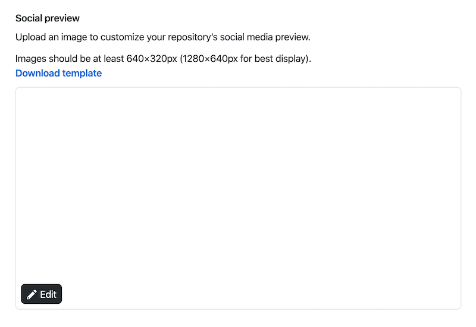

# Github Repo Social Image Generator

[中文文档](README.zh.md)

These is no tool to generate github repo social image, so I build one! 🌈🌈🌈

## Where you need the generated social image?

Github >> Settings 👇

Social image example 👇

Visit: [https://works.yangerxiao.com/github-social-image-generator/](https://works.yangerxiao.com/github-social-image-generator/?repo=https://github.com/zerosoul/github-social-image-generator). Input the github repo url, magic will happen automatically!

## Features

- Awesome texture backgroud image 🎉
- Custom fill backgroud color 🌈
- Edit the content as you like, including remove it! 🗑
- Download the result as PNG image to share! 🖼
- Mobile friendly 📱

## Thanks

- [Github API v4](https://developer.github.com/v4/)
- [apollo graphql](https://apollographql.com/docs/react/)
- [create-react-app](https://github.com/facebook/create-react-app)
- [react.js](https://reactjs.org)
- [react-color](https://github.com/casesandberg/react-color/)
- [antd](https://ant.design)
- [styled-components](https://styled-components.com): CSS-IN-JS Best Practice
- eslint + prettier: for better code
- husky + commitlint: for better git commit format
- Thanks the great Open Source

## Support

### Reward

